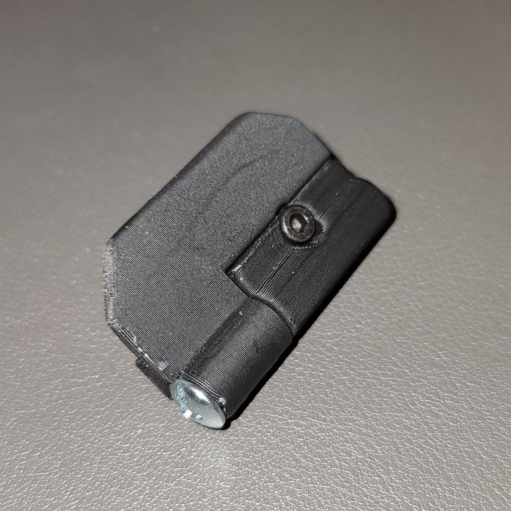
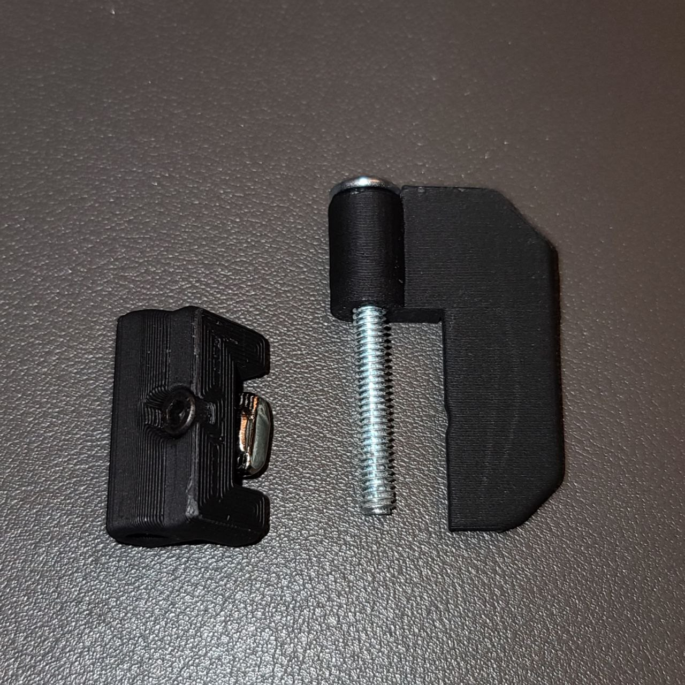
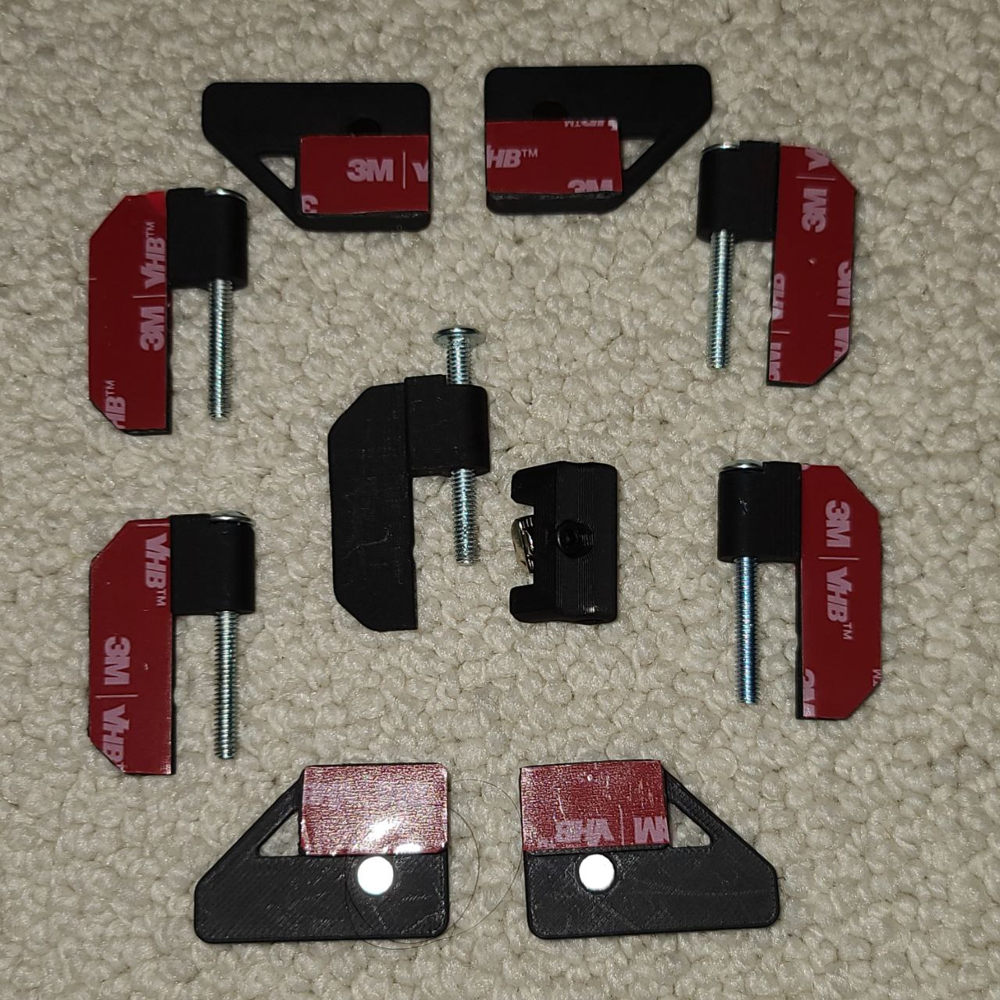
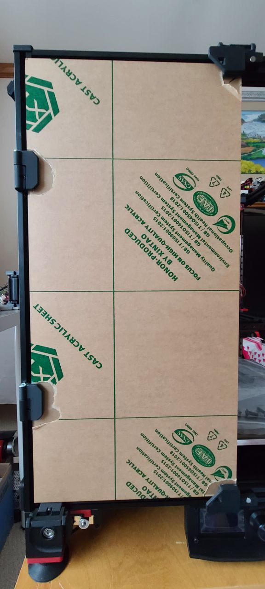

Removale Door Mount Hinges
==============================

For the matainance, Voron front doors should easily detachable

BOM
---

- 2x M4x40 SHCS or Philpis machine screws
- 4x M3x12 SHCS
- 4x M3 Hammer Head T-Nuts

Instructions
------------

- Use M4x40, make hinge through hole widen for easy to slide in and out
- When M4x40 insert into leaf, use screw driver for not easily got out

Images
------

